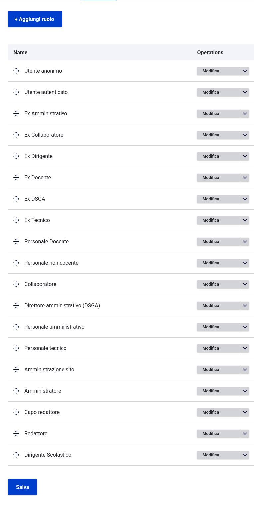

# Sunchronìzo Pròsopon
Sunchronìzo Pròsopon è un modulo Drupal che sincronizza i dati tipo [Persona](https://docs.google.com/spreadsheets/d/1MoayTY05SE4ixtgBsfsdngdrFJf_Z2KNvDkMF3tKfc8/edit#gid=1547596296).
Questo modulo usa `drupal/migrate` per importare le voci presenti nel repository [Krène](https://github.com/ouitoulia/krene) 

## Requisiti
- Drupal: >= 10
- Profilo Drupal: `minimal`
- Moduli contrib: `migrate_plus`, `migrate_tools`
- Moduli Ouitoulìa: `prosopon`

## Installazione
Per aggiungere e installare il modulo alla tua installazione esegui:
```
$ composer require ouitoulia/sunchronizo_prosopon
$ drush -y en sunchronizo_prosopon
```

## Uso del modulo
Puoi utilizzare il modulo:
- da interfaccia grafica;
- da CLI se hai bisogno di automatizzare l'installazione o l'aggiornamento.

In entrambi i casi, leggi la documentazione del modulo
Drupal `migrate` per maggiori dettagli.

Di seguito un esempio dei ruoli importati



## License

Copyright (C) 2023 https://github.com/ouitoulia

This program is free software: you can redistribute it and/or modify it under the terms of the GNU General Public License version 3 as published by the Free Software Foundation.

This program is distributed in the hope that it will be useful, but WITHOUT ANY WARRANTY; without even the implied warranty of MERCHANTABILITY or FITNESS FOR A PARTICULAR PURPOSE. See the GNU General Public License for more details.

Questo è un software libero: puoi ridistribuirlo e/o modificarlo secondo i termini della GNU General Public License versione 3 pubblicata dalla Free Software Foundation.

Questo programma è distribuito nella speranza che possa essere utile, ma SENZA ALCUNA GARANZIA; senza nemmeno la garanzia implicita di COMMERCIABILITÀ o IDONEITÀ PER UNO SCOPO PARTICOLARE. Vedere la GNU General Public License per maggiori dettagli.